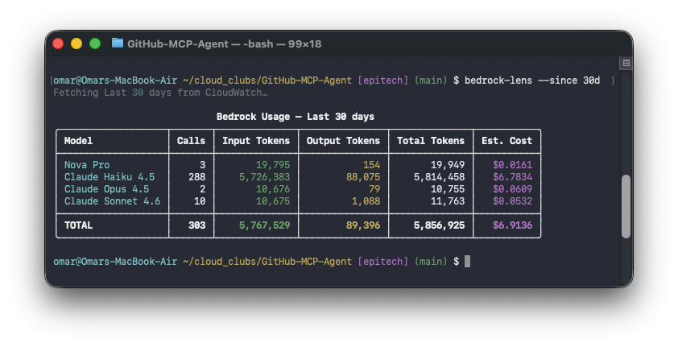

# bedrock-lens

Real-time token usage and cost monitoring for AWS Bedrock — because Cost Explorer won't tell you until tomorrow.



## The problem

When running Bedrock agents, you're flying blind. AWS Cost Explorer has a 24–48 hour lag. CloudWatch has live data, but getting to it requires knowing the log group name, converting dates to epoch milliseconds, parsing deeply nested JSON, and doing the cost math yourself.

There's no `bedrock usage` command. This is that command.

## Install

```bash
pip install bedrock-lens
```

Or with uv:

```bash
uv tool install bedrock-lens
```

## Usage

```bash
bedrock-lens                        # today's usage (default)
bedrock-lens --yesterday
bedrock-lens --week
bedrock-lens --since 2h             # last 2 hours
bedrock-lens --since 30m            # last 30 minutes
bedrock-lens --since 1d             # last 1 day
bedrock-lens --live                 # tail mode, refreshes every 5s
bedrock-lens --since 1h --live      # live tail for the last hour
bedrock-lens --live --threshold 2   # alert when spend crosses $2
bedrock-lens --setup                # one-time setup wizard
```

```bash
# different profile / region
bedrock-lens --profile my-profile --region us-west-2
```

## First-time setup

Bedrock doesn't log invocations by default. Run the setup wizard once per AWS account:

```bash
bedrock-lens --setup
```

This creates the CloudWatch log group, an IAM role for Bedrock to write to it, and enables model invocation logging. Takes about 10 seconds. After that, every Bedrock call shows up within ~30 seconds.

By default, the log group is created with no retention policy (AWS keeps logs forever). Use `--retention` to control this:

```bash
bedrock-lens --setup --retention 90   # expire logs after 90 days
bedrock-lens --setup --retention 0    # remove any existing retention policy
```

Omitting `--retention` leaves any existing policy untouched.

If you don't have IAM permissions to create roles, the wizard prints the exact policies and CLI command to hand off to your admin.

## How it works

Bedrock writes a JSON record to `/aws/bedrock/model-invocations` in CloudWatch for every model call. Each record contains the model ID, input token count, and output token count. `bedrock-lens` reads those records, applies per-model pricing, and renders the table.

Live mode (`--live`) polls every 5 seconds with a 90-second overlap window to handle CloudWatch's ingestion delay, deduplicating events by ID so nothing gets double-counted.

## Supported models

All models available on Amazon Bedrock are displayed with token counts. Cost estimation works as follows:

**Live pricing (via AWS Price List API):** Llama 3 / 3.1 / 3.2 / 3.3 / 4, Mistral, Mixtral, DeepSeek, Gemma, Qwen3, Nova, Kimi, MiniMax, Nemotron, GLM, and 50+ others. Prices are fetched at runtime for your region, so they stay up to date automatically.

**Hardcoded fallback:** Claude (Haiku, Sonnet, Opus — v3 through v4), Amazon Titan, Cohere Command R / R+, AI21 Jamba. AWS hasn't added these to the Price List API yet, so prices are bundled with the tool and updated on each release.

Token counts are always accurate for every model — they come directly from CloudWatch logs written by Bedrock itself. Only cost estimation depends on the pricing source; unknown models show `N/A` for cost but tokens are never affected.

## Requirements

- Python 3.9+
- AWS credentials with `logs:FilterLogEvents` on `/aws/bedrock/model-invocations`
- Bedrock model invocation logging enabled (run `--setup` if not)
